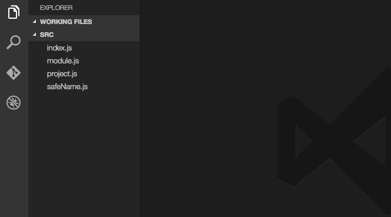
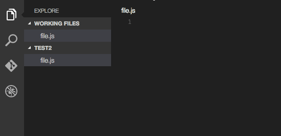

# README

## Create jsconfig.json - Visual Studio Code extension

Visual Studio Code has ES6 support, but requires it to be turned on from compiler options defined in jsconfig.json.
This extension provides an easy way to create the jsconfig.json file.

## Installation

To install, press `F1` and select `Extensions: Install Extensions` and then search for and select `Create jsconfig.json`.

## Usage

### Command

### Code action

## Participate

If you have any ideas, feel free to create issues and pull requests

